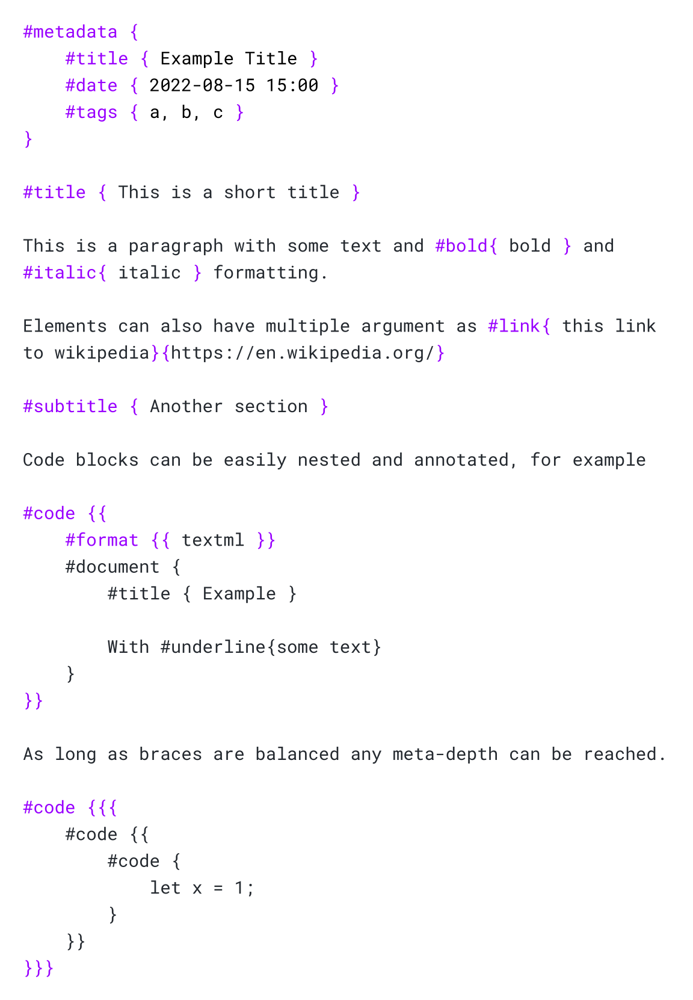

# textml

My personal textual markup language. Mostly a more structured alternative to Markdown as I prefer a more extensible language for writing content (and I will never use/setup [MDX](https://mdxjs.com/)).

## Introduction

A textml document is composed of various _blocks_ that can also be nested. A **block** can be a _text node_ or an _element node_. 

This language provides just the syntax and a part from that it can be used to describe various things, for example a markdown-like document can be described as follows

   
<i><a href="examples/document.tml">Example document from <code>examples/document.tml</code></a></i>

## Usage

For now there is a small CLI for working with the various "runtimes"

- `textml transpile OPTIONS...`

    Used to transpile TextML to other structured formats like json or html.

- `textml template [--output|-o OUTPUT] FILES...`

    Used to interpret TextML files as templates, for now the only supported directives are `#define{ NAME }{ TEMPLATE }`, `#{ NAME }`, `#import{ FILE }`, `#extends{ NAME }`.

